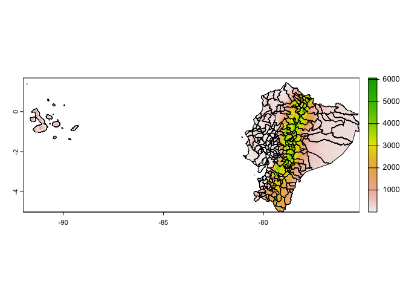
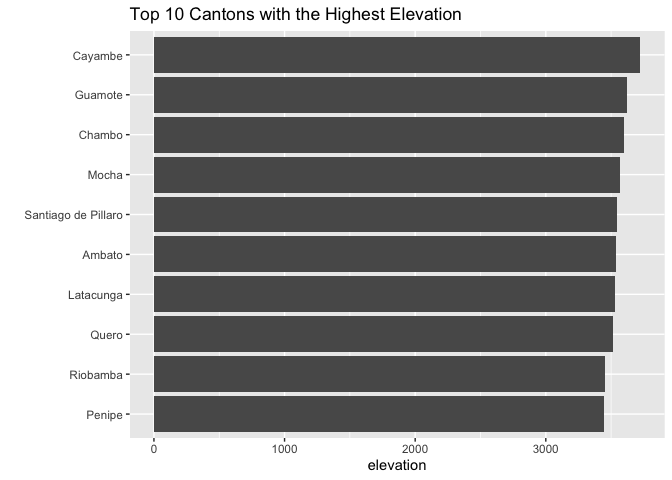

Geospatial analysis in R with terra: Calculating the average elevation
by canton in Ecuador
================
Alonso Quijano

# Ecuador shapefile

``` r
# Source: https://gadm.org/
# Load the sf package
if (!require("sf")) install.packages("sf")
```

    ## Loading required package: sf

    ## Linking to GEOS 3.10.2, GDAL 3.4.2, PROJ 8.2.1; sf_use_s2() is TRUE

``` r
# Unzip and load the Ecuador canton shapefiles
unzip("./data/GADM_ECU_shapefile.zip", exdir = "./data")
ecuador_shp <- st_read("./data/gadm41_ECU_2.shp")
```

    ## Reading layer `gadm41_ECU_2' from data source 
    ##   `/Users/elocarinista/Documents/R_projects/ECU_elevation/data/gadm41_ECU_2.shp' 
    ##   using driver `ESRI Shapefile'
    ## Simple feature collection with 223 features and 13 fields
    ## Geometry type: MULTIPOLYGON
    ## Dimension:     XY
    ## Bounding box:  xmin: -92.00854 ymin: -5.015803 xmax: -75.18715 ymax: 1.681835
    ## Geodetic CRS:  WGS 84

``` r
# Simplify the spatial geometries to improve computational efficiency
ecuador_shp <- st_simplify(ecuador_shp, preserveTopology = TRUE, dTolerance = 100)

# The sf CRS is WGS 84
st_crs(ecuador_shp)
```

    ## Coordinate Reference System:
    ##   User input: WGS 84 
    ##   wkt:
    ## GEOGCRS["WGS 84",
    ##     DATUM["World Geodetic System 1984",
    ##         ELLIPSOID["WGS 84",6378137,298.257223563,
    ##             LENGTHUNIT["metre",1]]],
    ##     PRIMEM["Greenwich",0,
    ##         ANGLEUNIT["degree",0.0174532925199433]],
    ##     CS[ellipsoidal,2],
    ##         AXIS["latitude",north,
    ##             ORDER[1],
    ##             ANGLEUNIT["degree",0.0174532925199433]],
    ##         AXIS["longitude",east,
    ##             ORDER[2],
    ##             ANGLEUNIT["degree",0.0174532925199433]],
    ##     ID["EPSG",4326]]

# GTOPO30 elevation data

``` r
# Source: https://www.usgs.gov/centers/eros/science/usgs-eros-archive-digital-elevation-global-30-arc-second-elevation-gtopo30?qt-science_center_objects=0#qt-science_center_objects
# Load the terra package
if (!require(terra)) install.packages("terra", repos='https://rspatial.r-universe.dev')
```

    ## Loading required package: terra

    ## Warning: package 'terra' was built under R version 4.2.3

    ## terra 1.7.35

``` r
# Unzip and load the GTOPO30 elevation data
unzip("./data/USGS_elevation.zip", exdir = "./data")
elevation <- rast("./data/gt30w100n40.tif")
names(elevation) <- "elevation"

# Plot the SpatRaster
plot(elevation)
```

<!-- -->

``` r
# The SpatRaster CRS is WGS 84
print(elevation)
```

    ## class       : SpatRaster 
    ## dimensions  : 6000, 4800, 1  (nrow, ncol, nlyr)
    ## resolution  : 0.008333333, 0.008333333  (x, y)
    ## extent      : -100, -60, -10, 40  (xmin, xmax, ymin, ymax)
    ## coord. ref. : lon/lat WGS 84 (EPSG:4326) 
    ## source      : gt30w100n40.tif 
    ## name        : elevation

# Masking and cropping

``` r
# Because the SpatRaster CRS is WGS 84, the same as the sf object, projection is not needed
# Masking the SpatRaster using the shapefile
elevation_ecu <- crop(elevation, ecuador_shp, mask = TRUE); rm(elevation)

# Plot the Ecuador elevation data
plot(elevation_ecu)
plot(ecuador_shp$geometry, add = TRUE)
```

<!-- -->

# Extracting the elevation for each canton

``` r
# Overall mean elevation
global(elevation_ecu, fun = 'mean', na.rm = TRUE)
```

    ##               mean
    ## elevation 1058.173

``` r
# Extract the weighted mean elevation for each canton
elevation_ecu_canton <- extract(elevation_ecu, ecuador_shp, fun = mean, na.rm = TRUE, weights = TRUE, bind = TRUE)

# Transform the SpatVector to data frame
elevation_ecu_canton <- as.data.frame(elevation_ecu_canton)
head(elevation_ecu_canton)
```

    ##       GID_2 GID_0 COUNTRY   GID_1 NAME_1 NL_NAME_1                NAME_2
    ## 1 ECU.1.1_1   ECU Ecuador ECU.1_1  Azuay        NA Camilo Ponce Enriquez
    ## 2 ECU.1.2_1   ECU Ecuador ECU.1_1  Azuay        NA             Chordeleg
    ## 3 ECU.1.3_1   ECU Ecuador ECU.1_1  Azuay        NA                Cuenca
    ## 4 ECU.1.4_1   ECU Ecuador ECU.1_1  Azuay        NA                El Pan
    ## 5 ECU.1.5_1   ECU Ecuador ECU.1_1  Azuay        NA                 Girón
    ## 6 ECU.1.6_1   ECU Ecuador ECU.1_1  Azuay        NA            Guachapala
    ##   VARNAME_2 NL_NAME_2 TYPE_2 ENGTYPE_2 CC_2   HASC_2 elevation
    ## 1        NA        NA Canton    Canton 0115       NA  815.7827
    ## 2        NA        NA Canton    Canton 0111 EC.AZ.CH 2744.1476
    ## 3        NA        NA Canton    Canton 0101 EC.AZ.CU 2879.8657
    ## 4        NA        NA Canton    Canton 0112 EC.AZ.EP 2757.0485
    ## 5        NA        NA Canton    Canton 0102 EC.AZ.GR 2697.3839
    ## 6        NA        NA Canton    Canton 0114 EC.LJ.GO 2591.5333

``` r
# Top 10 cantons with the highest elevation
# Load the tidyverse package
if (!require("tidyverse")) install.packages("tidyverse")
```

    ## Loading required package: tidyverse

    ## ── Attaching core tidyverse packages ──────────────────────── tidyverse 2.0.0 ──
    ## ✔ dplyr     1.1.2     ✔ readr     2.1.4
    ## ✔ forcats   1.0.0     ✔ stringr   1.5.0
    ## ✔ ggplot2   3.4.2     ✔ tibble    3.2.1
    ## ✔ lubridate 1.9.2     ✔ tidyr     1.3.0
    ## ✔ purrr     1.0.1     
    ## ── Conflicts ────────────────────────────────────────── tidyverse_conflicts() ──
    ## ✖ tidyr::extract() masks terra::extract()
    ## ✖ dplyr::filter()  masks stats::filter()
    ## ✖ dplyr::lag()     masks stats::lag()
    ## ℹ Use the conflicted package (<http://conflicted.r-lib.org/>) to force all conflicts to become errors

``` r
elevation_ecu_canton %>% arrange(desc(elevation)) %>% head(10) %>%
  ggplot(aes(x = reorder(NAME_2, elevation), y = elevation)) + 
  geom_bar(stat = "identity") + coord_flip() + 
  labs(title = "Top 10 Cantons with the Highest Elevation", x = "")
```

<!-- -->

``` r
# Save data frame as xlsx and csv
if (!require("xlsx")) install.packages("xlsx")
```

    ## Loading required package: xlsx

``` r
write.xlsx(elevation_ecu_canton, "./data/elevation_ecu_canton.xlsx")
write.csv(elevation_ecu_canton, "./data/elevation_ecu_canton.csv")
```
